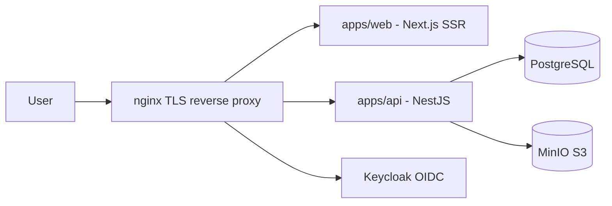

<p align="center">
  
</p>

<h1 align="center">Harcerski System Stopni (HSS)</h1>

<p align="center">
  Digital platform for ZHR instructor-rank workflows: documentation, commission process,
  auditability, and security by design.
</p>

<p align="center">
  <strong>Language:</strong> <a href="./README.md">Polski</a> | English
</p>

<p align="center">
  
  
  
  
  
  
  
</p>

<p align="center">
  <a href="#quick-start">
    
  </a>
  <a href="#architecture-overview">
    
  </a>
  <a href="#commands">
    
  </a>
  <a href="#security">
    
  </a>
  <a href="#contributors">
    
  </a>
</p>

## What is HSS?

**Harcerski System Stopni** supports instructor-rank commissions and scouts running instructor-rank
trials. The system digitizes documentation, enables asynchronous review before meetings, and improves
meeting organization (slots), reducing per-candidate handling time.

## Core principles

- Stateless-first architecture and readiness for horizontal scaling.
- RBAC enforced at the API boundary (frontend checks are UX-only).
- Shared contracts via Zod schemas as source of truth.
- Security by default: boundary validation, no token storage in `localStorage`, and sensitive-data redaction.

<a id="architecture-overview"></a>
## Architecture overview



## Repository structure

- `apps/web` - Next.js frontend (SSR + `next-intl`)
- `apps/api` - NestJS backend
- `packages/schemas` - shared Zod contracts (source of truth)
- `packages/database` - Prisma schema, migrations, and seed
- `docker` - local infrastructure (nginx, Keycloak, PostgreSQL, MinIO)
- `docs` - functional and technical documentation

## Local requirements

- Node.js `>= 24.12.0`
- pnpm `>= 10.26.0`
- Docker + Docker Compose

## Quick start

### Option A: one command (cold start)

```bash
pnpm start:cold
```

### Option B: manual (recommended for first run)

1. Install dependencies:
   ```bash
   pnpm install
   ```
2. Copy `.env` files:
   - `docker/.env.example` -> `docker/.env`
   - `apps/api/.env.example` -> `apps/api/.env`
   - `apps/web/.env.example` -> `apps/web/.env`
   - `packages/database/.env.example` -> `packages/database/.env`
3. Start infrastructure:
   ```bash
   pnpm stack:up
   ```
4. Generate and migrate database:
   ```bash
   pnpm db:generate
   pnpm db:migrate
   ```
5. Start applications:
   ```bash
   pnpm dev
   ```

### Local endpoints (default)

- `https://hss.local` - web
- `https://api.hss.local` - API
- `https://auth.hss.local` - Keycloak
- `https://authconsole.hss.local` - Keycloak Admin Console
- `https://s3.hss.local` - MinIO API
- `https://s3console.hss.local` - MinIO Console

## Commands

| Goal | Command |
|---|---|
| Development | `pnpm dev` |
| Build | `pnpm build` |
| Lint | `pnpm lint` |
| Typecheck | `pnpm typecheck` |
| Tests | `pnpm test` |
| Dependency audit | `pnpm audit` |
| Start stack | `pnpm stack:up` |
| Stop stack | `pnpm stack:down` |

<a id="security"></a>
## Security

- Vulnerability reporting: [SECURITY.en.md](./SECURITY.en.md)
- Engineering rules and quality gates: [CONTRIBUTING.en.md](./CONTRIBUTING.en.md)
- Code of Conduct: [CODE_OF_CONDUCT.en.md](./CODE_OF_CONDUCT.en.md)
- Never commit secrets (`.env`, tokens, keys, passwords).

## Documentation

- Project start: [docs/91-START.pl.md](./docs/91-START.pl.md)
- Full list: [docs](./docs)

## Contributors

<a href="https://github.com/Nikovsky/Harcerski-System-Stopni/graphs/contributors">
  
</a>

## License

This project is licensed under **AGPL-3.0-only**. See [LICENSE](./LICENSE).
