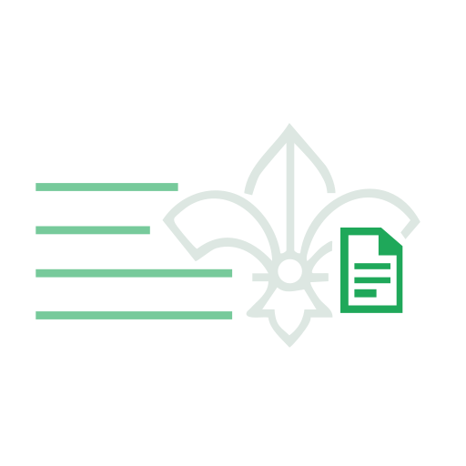
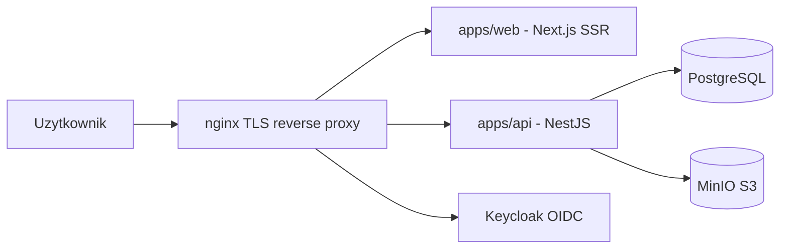

<p align="center">
  
</p>

<h1 align="center">Harcerski System Stopni (HSS)</h1>

<p align="center">
  Cyfrowa obsluga prob instruktorskich ZHR: dokumentacja, workflow komisji, audyt i bezpieczenstwo.
</p>

<p align="center">
  <strong>Jezyk:</strong> Polski | <a href="./README.en.md">English</a>
</p>

<p align="center">
  
  
  
  
  
  
  
</p>

<p align="center">
  <a href="#szybki-start">
    
  </a>
  <a href="#architektura-w-skrocie">
    
  </a>
  <a href="#komendy">
    
  </a>
  <a href="#bezpieczenstwo">
    
  </a>
  <a href="#contributors">
    
  </a>
</p>

## Co to jest HSS?

**Harcerski System Stopni** to aplikacja wspierajaca proces pracy komisji stopni instruktorskich ZHR oraz komunikacje z harcerzami realizujacymi proby na stopnie instruktorskie. System cyfryzuje dokumentacje, umozliwia wczesniejsze zapoznanie sie z probami i usprawnia organizacje posiedzen komisji (sloty), skracajac czas obslugi pojedynczego harcerza.

## Najwazniejsze zalozenia

- Architektura stateless-first i gotowosc na skalowanie horyzontalne.
- RBAC egzekwowany po stronie API (frontend jest warstwa UX).
- Spojne kontrakty przez wspoldzielone schematy Zod.
- Security-by-default: walidacja wejscia, brak tokenow w `localStorage`, redakcja danych wrazliwych.

<a id="architektura-w-skrocie"></a>
## Architektura (w skrocie)



## Struktura repozytorium

- `apps/web` - frontend Next.js (SSR + `next-intl`)
- `apps/api` - backend NestJS
- `packages/schemas` - wspoldzielone kontrakty Zod (source of truth)
- `packages/database` - Prisma schema, migracje i seed
- `docker` - lokalna infrastruktura (nginx, Keycloak, PostgreSQL, MinIO)
- `docs` - dokumentacja funkcjonalna i techniczna

## Wymagania lokalne

- Node.js `>= 24.12.0`
- pnpm `>= 10.26.0`
- Docker + Docker Compose

## Szybki start

### Opcja A: 1 komenda (cold start)

```bash
pnpm start:cold
```

### Opcja B: manualnie (zalecane przy pierwszym uruchomieniu)

1. Instalacja zaleznosci:
   ```bash
   pnpm install
   ```
2. Skopiowanie plikow `.env`:
   - `docker/.env.example` -> `docker/.env`
   - `apps/api/.env.example` -> `apps/api/.env`
   - `apps/web/.env.example` -> `apps/web/.env`
   - `packages/database/.env.example` -> `packages/database/.env`
3. Start infrastruktury:
   ```bash
   pnpm stack:up
   ```
4. Generacja i migracje bazy:
   ```bash
   pnpm db:generate
   pnpm db:migrate
   ```
5. Start aplikacji:
   ```bash
   pnpm dev
   ```

### Lokalne endpointy (domyslne)

- `https://hss.local` - web
- `https://api.hss.local` - API
- `https://auth.hss.local` - Keycloak
- `https://authconsole.hss.local` - Keycloak Admin Console
- `https://s3.hss.local` - MinIO API
- `https://s3console.hss.local` - MinIO Console

## Komendy

| Cel | Komenda |
|---|---|
| Development | `pnpm dev` |
| Build | `pnpm build` |
| Lint | `pnpm lint` |
| Typecheck | `pnpm typecheck` |
| Testy | `pnpm test` |
| Audit zaleznosci | `pnpm audit` |
| Start stacka | `pnpm stack:up` |
| Stop stacka | `pnpm stack:down` |

<a id="bezpieczenstwo"></a>
## Bezpieczenstwo

- Zglaszanie podatnosci: [SECURITY.md](./SECURITY.md)
- Zasady inzynieryjne i quality gates: [CONTRIBUTING.md](./CONTRIBUTING.md)
- Kodeks postepowania: [CODE_OF_CONDUCT.md](./CODE_OF_CONDUCT.md)
- Wersja angielska dokumentacji: [README.en.md](./README.en.md), [SECURITY.en.md](./SECURITY.en.md), [CONTRIBUTING.en.md](./CONTRIBUTING.en.md)
- Nigdy nie commituj sekretow (`.env`, tokeny, klucze, hasla).

## Dokumentacja

- Start projektu: [docs/91-START.pl.md](./docs/91-START.pl.md)
- Pelna lista: [docs](./docs)

## Contributors

<a href="https://github.com/Nikovsky/Harcerski-System-Stopni/graphs/contributors">
  
</a>

## Licencja

Projekt jest licencjonowany na **AGPL-3.0-only**. Szczegoly: [LICENSE](./LICENSE).
