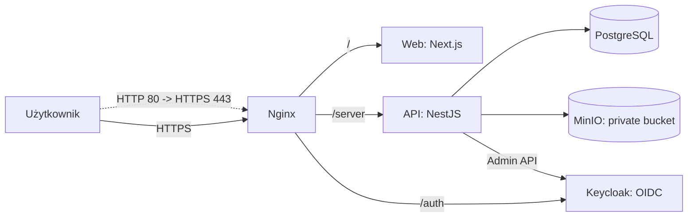
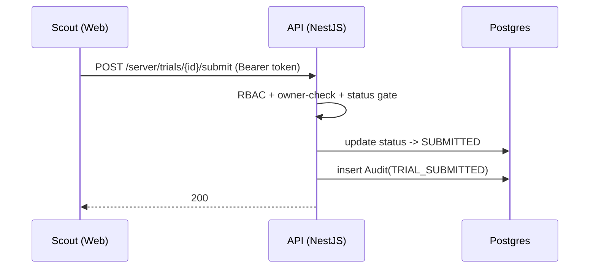
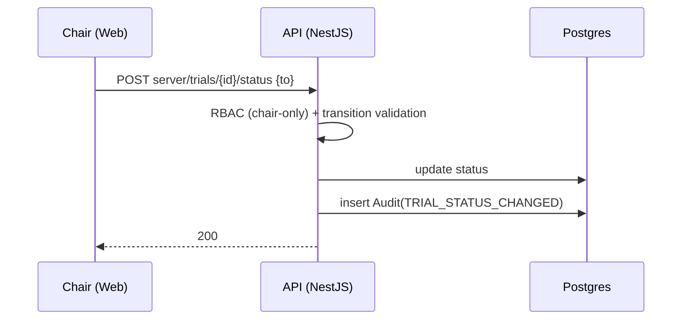
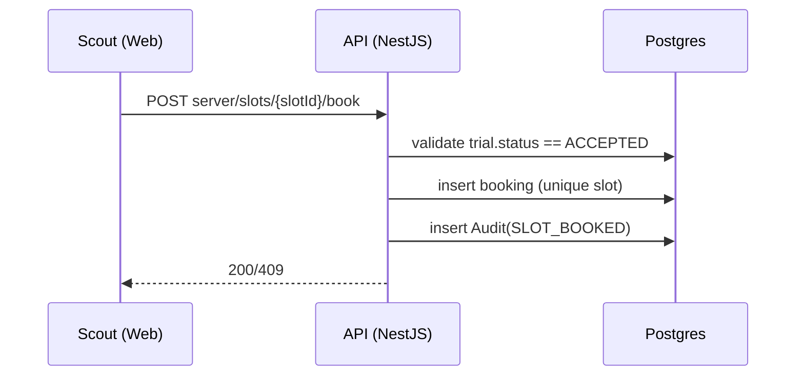

# Architecture — HSS (MVP)

## 1) Architektura wysokiego poziomu

### Styl

- **Modular Monolith** dla API (NestJS) — moduły domenowe w jednej aplikacji.
- Web (Next.js) jako UI dla harcerzy/komisji/admina.
- **Keycloak** jako centralny IdP (OIDC) + zarządzanie rolami.
- **Nginx** jako reverse proxy i routing wejścia.
- PostgreSQL jako DB.
- MinIO jako storage obiektów dla załączników.
- Dostarczenie przez docker-compose (self-hosted).

### Diagram komponentów

### Routing (Nginx)

- `/` → web
- `/server/` → api
- `/auth/` → keycloak

---

## 2) Moduły backend (NestJS)

### Moduły domenowe (MVP)

- `authz` — weryfikacja JWT (Keycloak), RBAC, guards, owner-checks
- `users` — shadow profile (cache minimalny) + synchronizacja “na żądanie”
- `trials` — próby, statusy, reguły aktywności (jedna aktywna próba)
- `tasks` — zadania w ramach próby
- `comments` — komentarze komisji
- `attachments` — init/complete upload, download URL, limity, autoryzacja
- `meetings` — posiedzenia, sloty, rezerwacje, anulowanie przez komisję
- `audit` — zapis zdarzeń domenowych do DB
- `admin` — endpointy admina (approve/reject, role management) + Keycloak Admin API client
- `health` — `/server/health`

### Wymagania twarde

- Backend egzekwuje RBAC i owner-checks (frontend nie jest źródłem prawdy).
- Wszystkie operacje wrażliwe (statusy, admin, attachments, booking) są audytowane.

---

## 3) Tożsamość i autoryzacja (Keycloak OIDC)

### OIDC Clients (default)

- `hss-web` — Authorization Code Flow + PKCE (public client)
- `hss-api` — bearer-only (API tylko weryfikuje tokeny)
- `hss-admin-service` — service account (do Keycloak Admin API)

### Tokeny

- Web uzyskuje `access_token` z Keycloak.
- Wywołania API: `Authorization: Bearer <access_token>`.
- API waliduje:
  - issuer (`KEYCLOAK_ISSUER_URL`)
  - podpis (JWKS)
  - audience/client (`hss-api`)
  - role z claims (mapper w Keycloak)

### Role (client roles w Keycloak dla `hss-api`)

- `SCOUT`
- `COMMISSION_MEMBER`
- `COMMISSION_SECRETARY`
- `COMMISSION_CHAIR`
- `ADMIN`
- `ROOT`

### Harcerze (MVP)

- Self-registration w Keycloak (dowolna domena email).
- **Approval flow (WYMAGANIE):** po rejestracji konto ma `enabled=false`.
- Admin akceptuje konto (enable) w panelu admina w aplikacji (UI) → API → Keycloak Admin API.

### Komisja (MVP)

- Self-registration w Keycloak (dowolna domena email).
- Role komisji są przypisywane i mogą być zmieniane przez `ADMIN`.

### Wymagania twarde

- API akceptuje wyłącznie tokeny wystawione przez Keycloak (JWKS).
- Dostęp do danych prób tylko dla ownera + komisji + admina + root.
- Zmiana statusu tylko `COMMISSION_CHAIR`.

---

## 4) Model autoryzacji (RBAC + owner)

### RBAC

- `SCOUT`:
  - CRUD na własnej próbie w `DRAFT|NEEDS_CHANGES`
  - submit próby
  - podgląd komentarzy i statusu
  - rezerwacja slotu tylko po `ACCEPTED`

- `COMMISSION_MEMBER`:
  - list/details prób
  - komentarze

- `COMMISSION_SECRETARY`:
  - wszystko co member +
  - posiedzenia/sloty + anulowanie/przeniesienie rezerwacji

- `COMMISSION_CHAIR`:
  - wszystko co secretary +
  - zmiana statusów prób

- `ADMIN`:
  - admin endpoints (approval, role management)
  - read-only audit
  - techniczny nadzór

- `ROOT`:
  - pełny dostęp do wszystkich komponentów

### Owner-checks (IDOR prevention)

- Harcerz może widzieć tylko swoje próby/załączniki.
- Komisja ma dostęp do prób/załączników w ramach roli.
- Załączniki pobierane wyłącznie przez endpoint autoryzowany w API.

---

## 5) Statusy próby i reguły

### Status machine

- `DRAFT` → `SUBMITTED`
- `SUBMITTED` → `NEEDS_CHANGES | ACCEPTED | REJECTED`
- `NEEDS_CHANGES` → `SUBMITTED`
- `ACCEPTED` → `ARCHIVED`

### Reguły edycji

- Edycja tylko w `DRAFT|NEEDS_CHANGES`.
- Po submit (`SUBMITTED`) próba read-only.
- Jedna aktywna próba per harcerz:
  - aktywne: `DRAFT|SUBMITTED|NEEDS_CHANGES|ACCEPTED`
  - nowa próba dopiero po `REJECTED|ARCHIVED`.

---

## 6) Załączniki (MinIO, presigned URLs)

### Workflow upload

1. `attachments/init` — walidacja MIME/rozmiaru + utworzenie rekordu
2. API generuje presigned PUT (TTL)
3. Web uploaduje plik bezpośrednio do MinIO
4. `attachments/complete` — potwierdzenie uploadu
5. Download: autoryzowany endpoint generuje presigned GET (TTL)

### Wymagania twarde

- Bucket prywatny (brak publicznych URL).
- Limity uploadu egzekwowane w API (startowo: 5/10/50 MB + 100MB/próba).

---

## 7) Posiedzenia i sloty

### Encje

- `Meeting` (data, opis)
- `MeetingSlot` (start/end)
- `SlotBooking` (slot ↔ próba ↔ harcerz)
- `MeetingDay` (cały dzień posiedzenia)

### Reguły (MVP)

- Rezerwacja slotu/dnia tylko jeśli próba ma status `ACCEPTED`.
- Jeden slot może być zarezerwowany tylko raz (unikalność).
- Anulowanie/przeniesienie:
  - **MVP:** tylko komisja (`COMMISSION_SECRETARY|COMMISSION_CHAIR`), nie harcerz.

- Wszystko audytowane.

---

## 8) Admin panel w aplikacji (MVP)

### Zakres

- Pending accounts:
  - lista kont oczekujących (enabled=false)
  - approve (enable=true)
  - reject (pozostaje disabled + reason)

- Commission roles:
  - assign/change/clear role komisji (client roles w Keycloak)

### Integracja techniczna

- Web → API (admin endpoints) → Keycloak Admin REST API
- Autoryzacja admin endpoints:
  - wymagane role `ADMIN` w tokenie

- Operacje admina tworzą wpisy w `AuditEvent`.

---

## 9) Observability (MVP)

- Logi JSON do stdout (api/web) + `requestId` z Nginx.
- Audit trail w DB dla działań krytycznych (statusy, booking, attachments, admin).

---

## 10) Przepływy krytyczne (sequence)

### 10A) Submit próby

### 10B) Zmiana statusu (chair-only)

### 10C) Booking slotu (ACCEPTED-only)

---

## Wymagania twarde

- OIDC (Keycloak) jako jedyny mechanizm auth.
- RBAC + owner-checks w API.
- Zmiana statusu tylko `COMMISSION_CHAIR`.
- Approval kont harcerzy przez `ADMIN`.
- Presigned upload/download + prywatny bucket.
